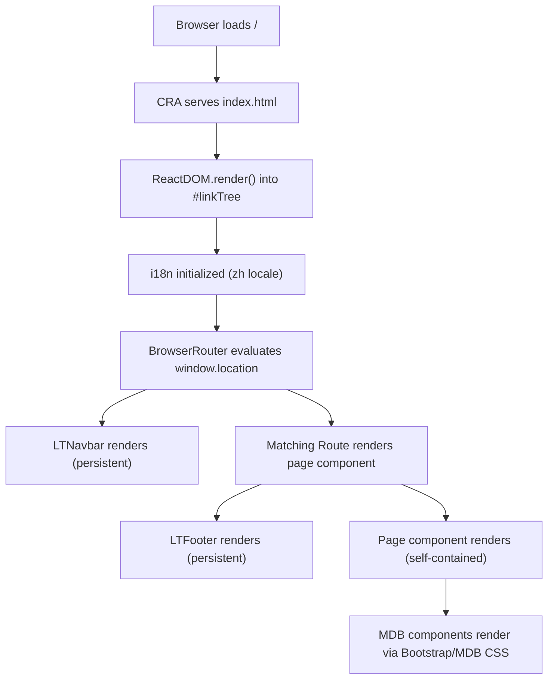
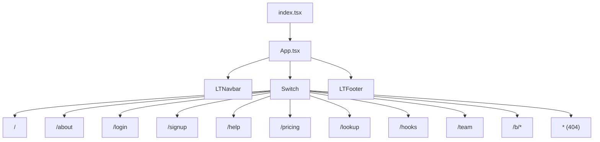

# Architecture Overview

## Architecture Pattern

LinkTR Web is a **Single-Page Application (SPA)** built with React and React Router. It follows a flat component architecture — there is no state management library, no global store, and no backend API calls in the current implementation. Each page component is self-contained.

The architecture can be described as **presentation-only**: the app renders UI and marketing content, with authentication and link-management functionality scaffolded but not yet connected to a backend.

---

## Request Lifecycle

---

## Application Structure

---

## Key Abstractions & Design Patterns

| Pattern | Usage |
|---|---|
| **React Router `withRouter` HOC** | Wraps most page components to inject `history`, `location`, `match` props — though most pages don't actively consume them |
| **`withTranslation` HOC** | Wraps `LTNavbar` (class component) to inject the `t()` function |
| **`useTranslation` hook** | Used in all functional page components for i18n |
| **SCSS Modules** | `style.module.scss` used in the Vultr component for scoped styles |
| **Component composition** | Shared components (`LTAnimationLogo`, `LTFeaturesPage`, `LTImagesCarousel`, `Vultr`) are imported and composed into pages |

---

## External Dependencies & Third-Party Services

| Service | Usage |
|---|---|
| **Unsplash** | Remote images embedded in feature cards, sign-in/sign-up hero images (hardcoded URLs) |
| **Vultr** | Affiliate referral banner embedded on multiple pages (`ref=8991180-8H`) |
| **Font Awesome** | Icon library loaded via npm package; used for nav and social icons |
| **MDB Bootstrap** | UI component framework providing cards, navbars, modals, forms, etc. |
| **SWR** | Listed as dependency but not yet used for any data fetching |
| **Highcharts** | Listed as dependency but not yet used in any page |

---

## State Management

There is **no global state management**. All state is local component state via `useState`:

- `LTNavbar` — `collapse` (mobile menu open/close) and `isWideEnough` (responsive flag)
- `LTYoutubeIDLookUp` — `url` (current input value / extracted ID)
- `LTCounting` — `count` (click counter)

---

## Styling Approach

| Layer | Technology |
|---|---|
| Base reset & grid | `bootstrap-css-only` |
| Component styles | `mdbreact/dist/css/mdb.css` |
| Icons | `@fortawesome/fontawesome-free/css/all.min.css` |
| Global overrides | `src/index.css` |
| Page-level styles | Plain CSS files (`LTHome.css`, `sessions/index.css`, `links/index.css`) |
| Scoped component styles | SCSS Modules (`vultr/style.module.scss`) |

---

## Scalability Considerations

- **No backend integration** — The current app is fully static. Real user authentication, link persistence, and analytics will require a backend API and state management.
- **Hard-coded link data** — `LTMyListGroup` has links hard-coded in the component. Dynamic user profiles will require API calls (SWR is already in dependencies for this purpose).
- **i18n extension** — The English translation object is nearly empty; full EN support requires populating all translation keys.
- **Highcharts + SWR** — Both are installed but unused, suggesting analytics and real-time data features are planned.
