# Frontend Components

## UI Framework & Component Library

- **React 17** with TypeScript
- **MDBReact** (Material Design Bootstrap for React) — provides the primary component set: navbars, cards, buttons, inputs, grids, modals, carousels, badges, animations, etc.
- **Bootstrap CSS** (CSS only, no JS) as the grid/reset foundation
- **Font Awesome 5** for icons

---

## Page / Route Structure

```mermaid
graph TD
    A["/ — Home (LTHome)"]
    B["/about — About (LTAbout)"]
    C["/login — Sign In (LTSignIn)"]
    D["/signup — Sign Up (LTSignUp)"]
    E["/help — Help (LTHelp)"]
    F["/pricing — Pricing (LTPricingPlans)"]
    G["/lookup — YouTube ID Lookup"]
    H["/hooks — Hooks Demo"]
    I["/team — Team (LTMember)"]
    J["/b/* — Public Link Profile (LTMyListGroup)"]
    K["* — 404 Error (LTError)"]
```

---

## Page Components

### `LTHome` (`src/pages/about/LTHome.tsx`)
Landing/marketing page. Renders the logo, two CTA buttons (sign up / log in), a features section, and the Vultr affiliate banner.

### `LTAbout` (`src/pages/about/LTAbout.tsx`)
About page. Contains an image carousel (`LTImagesCarousel`), a promotional text block with a "Join Us" CTA, and the Vultr banner.

### `LTSignIn` (`src/pages/sessions/LTSignIn.tsx`)
Split-layout sign-in form. Left column: email + password inputs + login button. Right column: hero image with a sign-up CTA overlay.

### `LTSignUp` (`src/pages/sessions/LTSignUp.tsx`)
Split-layout sign-up form (mirror of sign-in). Left: hero image with login CTA. Right: email, password, confirm password + sign-up button.

### `LTHelp` (`src/pages/about/LTHelp.tsx`)
Help/FAQ page.

### `LTPricingPlans` (`src/pages/about/LTPricingPlans.tsx`)
Three-column pricing card layout for Free / Pro / Enterprise tiers. All copy is i18n-driven.

### `LTMember` (`src/pages/team/LTMember.tsx`)
Team page. Renders a card grid of team members defined in a local array. Each member has a name, title, description (in Chinese), avatar, and social links (Facebook, Twitter, GitHub, LinkedIn, Instagram).

### `LTMyListGroup` (`src/pages/links/LTMyListGroup.tsx`)
The core product page. Renders a vertical `MDBListGroup` of hard-coded links. Intended to be user-specific via the `/b/:username` route, but currently always shows the owner's links.

### `LTYoutubeIDLookUp` (`src/pages/social/LTLTYoutubeIDLookUp.tsx`)
Single-input utility page. Accepts a YouTube URL, extracts the video ID in real-time via regex on every `onChange` event.

### `LTHookIndex` / `LTCounting` (`src/pages/hooks/`)
Demo page combining `LTAnimationLogo` and a counter widget (`LTCounting`) that uses `useState` + `useEffect` to update the document title.

---

## Shared / Reusable Components

### `LTNavbar` (`src/components/LTNavbar.tsx`)
- **Type:** Class component
- **State:** `collapse` (boolean — mobile menu toggle), `isWideEnough` (boolean — hides hamburger on wide screens)
- **Key behavior:** Responsive hamburger menu. Nav links: Home, About, Pricing, Team, Help. Right side: Beta badge + login icon.
- **i18n:** Wrapped with `withTranslation()` HOC.

### `LTFooter` (`src/components/LTFooter.tsx`)
Four-column footer with "about us" copy, and three columns of hard-coded external links (personal site, blog, GitHub, LinkedIn, etc.). Copyright year auto-calculated via `new Date().getFullYear()`.

### `LTAnimationLogo` (`src/components/LTAnimationLogo.tsx`)
Bouncing animated logo using `MDBAnimation type="bounce" infinite`. Used as a page header in sign-in, sign-up, hooks, and lookup pages.

### `LTFeaturesPage` (`src/components/LTFeaturesPage.tsx`)
Three-column image card grid showcasing features. Images sourced from Unsplash. Copy is i18n-driven.

### `LTImagesCarousel` (`src/components/LTImagesCarousel.tsx`)
Image carousel component. Used on the About page.

### `LTFrameModal` (`src/components/LTFrameModal.tsx`)
Modal wrapper component (usage not wired into current routes).

### `LTGridCarousel` (`src/components/LTGridCarousel.tsx`)
Grid-based carousel component (usage not wired into current routes).

### `LTJumbotronPage` (`src/components/LTJumbotronPage.tsx`)
Jumbotron/hero section component (usage not wired into current routes).

### `LTSocialSlidePage` (`src/components/LTSocialSlidePage.tsx`)
Social media slide component (usage not wired into current routes).

### `LTTestimonials` (`src/components/LTTestimonials.tsx`)
Testimonials block (usage not wired into current routes).

### `LTInput` (`src/components/LTInput.tsx`)
Custom input wrapper (usage not wired into current routes).

### `LTError` (`src/components/LTError.tsx`)
404 / catch-all error page rendered for any unmatched route.

### `Vultr` (`src/pages/vultr/index.tsx`)
Affiliate referral banner. Styled via `style.module.scss`. Embedded in Home, About, Pricing, and Team pages.

---

## State Management

No global store. All state is local `useState`. See architecture.md for details.

---

## API Integration

No API calls are currently wired. SWR is installed as a dependency, suggesting future integration with a REST API for dynamic link data, user authentication, and analytics.

---

## Styling

| Scope | Approach |
|---|---|
| Global | `src/index.css` |
| Page-level | Colocated CSS files (e.g., `LTHome.css`, `sessions/index.css`) |
| Component-scoped | SCSS Modules (`vultr/style.module.scss`) |
| Framework | MDB CSS + Bootstrap CSS imported in `index.tsx` |
